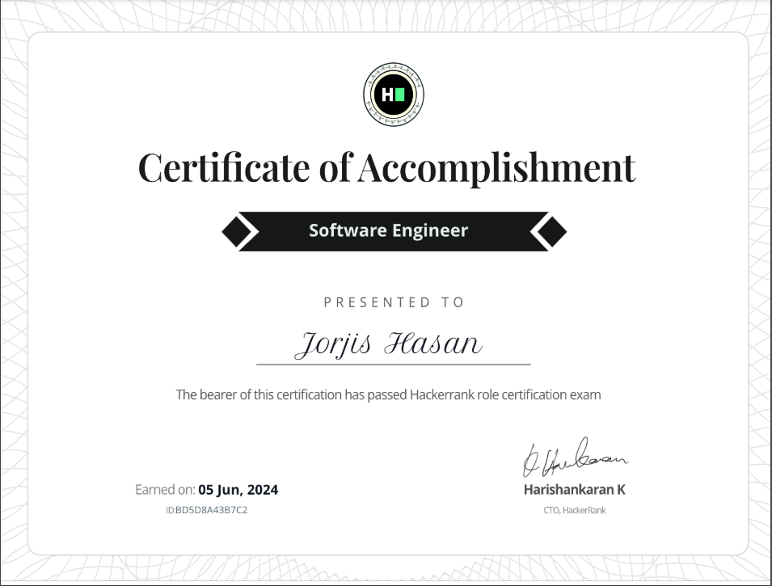

# ROLE: Software Engineer 



Checkout the solutions at one go 🚀

## SQL: The Perfect Arrangement

```sql
SELECT ID, FIRST_NAME, LAST_NAME
FROM CUSTOMERS
WHERE LENGTH(CONCAT(FIRST_NAME, LAST_NAME)) < 12
ORDER BY LENGTH(CONCAT(FIRST_NAME, LAST_NAME)), CONCAT(FIRST_NAME, LAST_NAME), ID;
```

## Problem Solving: Conference Schedule

```python
def maxPresentations(scheduleStart, scheduleEnd):
    # Combine start and end times into tuples for easier sorting
    presentations = [(start, end) for start, end in zip(scheduleStart, scheduleEnd)]

    presentations.sort(key=lambda x: x[1])
    
    max_presentations = 0
    current_end_time = 0
    
    for start, end in presentations:
        # If the current presentation starts after the previous one ends, attend it
        if start >= current_end_time:
            max_presentations += 1
            current_end_time = end
    
    return max_presentations

```

## REST API: Patient's Medical Record

```python
import requests

def getAverageTemperatureForUser(userId):
    base_url = "https://jsonmock.hackerrank.com/api/medical_records"

    page = 1
    total_temps = 0
    total_records = 0

    while True:
        response = requests.get(f"{base_url}?userId={userId}&page={page}").json()
        data = response["data"]

        if not data:
            break

        for record in data:
            body_temperature = record.get("vitals", {}).get("bodyTemperature", 0)
            total_temps += body_temperature
            total_records += 1

        if page >= response["total_pages"]:
            break

        page += 1

    if total_records == 0:
        return "0"

    average_temp = round(total_temps / total_records, 1)
    return str(average_temp)
```


